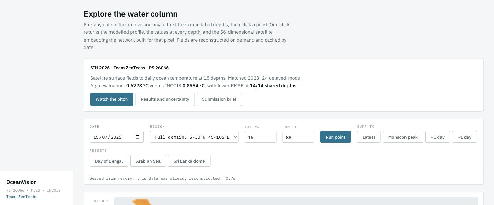

# OceanVision

**See beneath the ocean surface.**

OceanVision reconstructs daily subsurface temperature across the North Indian Ocean from surface satellite observations. Built by **Team ZenTechs** for Smart India Hackathon 2026, **PS SIH26066**, Ministry of Earth Sciences / INCOIS. Team ID: **130957**.

[Explore the prototype](https://oceanembed-prototype.vercel.app/) · [Watch the pitch](https://youtu.be/BSgT3coOmeM) · [Submission brief](docs/SUBMISSION.md)

## The result

On the repaired 2023–24 delayed-mode Argo benchmark, OceanVision achieves **0.6778°C** mean-depth RMSE versus INCOIS **0.8554°C**.

| What improved | Measured result |
|---|---|
| Mean-depth RMSE | **20.8% lower** than INCOIS |
| Shared depth point wins | **14 / 14** |
| Depths with simultaneous uncertainty support | **10 / 14** |
| Evaluation sample | **96 floats · 69,183 support-verified rows** |

A point win is a lower measured RMSE, not a guarantee at every depth on future data. [Full results and validation scope](docs/RESULTS.md).

## What you can explore

- Daily temperature maps on a 0.25° grid across **5–30°N, 45–105°E**.
- Point profiles at **15 depths, from 0 to 1000 m**.
- A 3D water column and the learned ocean representation.
- Validation results and the recorded pitch.

The current prototype archive spans **1993-01-01 to 2025-12-31**. These are reconstructions of archived observations, not future forecasts. [Use the prototype](docs/DEMO.md).

## Submission resources

| Resource | Link |
|---|---|
| Live prototype | [oceanembed-prototype.vercel.app](https://oceanembed-prototype.vercel.app/) |
| Pitch video | [Team ZenTechs pitch](https://youtu.be/BSgT3coOmeM) |
| Submission brief | [docs/SUBMISSION.md](docs/SUBMISSION.md) |
| Validation summary | [docs/RESULTS.md](docs/RESULTS.md) |

This repository contains the project showcase and submission material. The implementation, training recipes, model artifacts, datasets and full application source are kept separately. For project enquiries, contact [the repository owner](https://github.com/devanshranjan10).
